# Lab 3: Submit Forms to a List

We've got a shiny new Microsoft Forms form and we can easily collect responses and download them to Excel and that's great! But, we can use Power Automate to direct those responses to somewhere more useful.

We want to accept Design Requests from as many sources as possible and we want to lower the barrier of entry enough that we get plenty of responses. We want to use those requests to feed our workstream, but we don't want just any old junk getting assigned to us. We'll be using the triage pattern to accept requests into a triage list where items can be sorted, adjusted, and only move on once they're in a good state.

Here's a technical drawing:

> :bulb: We're professionals and so can you!

Also, if you didn't finish the form or ran into trouble, here's a link to copy the form into your tenant: https://forms.office.com/Pages/ShareFormPage.aspx?id=ZmB4d5LZv0Gs188U2oRP_SgB4nRVA7RLsq9_SGo5o3hUOEFUWDA0WU4yMkQ2OFFNNFpLSkNSQlNJSC4u&sharetoken=eblJmSBhNgeiCsnV7Mts

## :rocket: Exercise 1: Create the triage list

1. Click the New dropdown button in the top-left corner under the site header and choose **List**:

    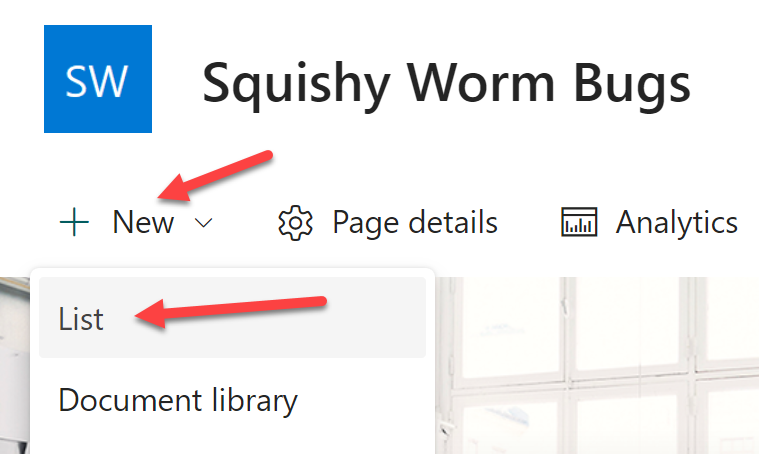

1. Choose **Blank list** and name your list **DesignTriage** (no spaces) then click **Create**:

    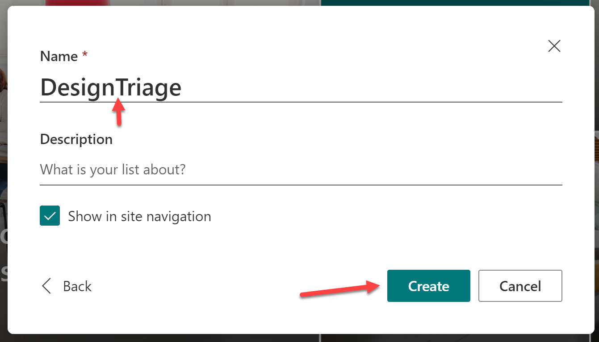

> :bulb: We left the space out to prevent the URL from having an ugly %20 where the space would be. Now we'll fix the way it displays while keeping the URL oh so pretty

> :warning: Depending on what release ring your tenant is on, you may be directed to the modern list view page within SharePoint or you may end up on Microsoft Lists. It's highly irritating. If you end up on Microsoft Lists (no header or menu to get back to your site), you can edit the url to go to the root of the site and click on the navigation link to the list in the menu and this _should_ respect your preference to stay in the site list view.

1. Click on the list name and add the space in the **Rename** dialog then click **Save**. Now the URL is pretty and the display name is pretty. Rejoice!

    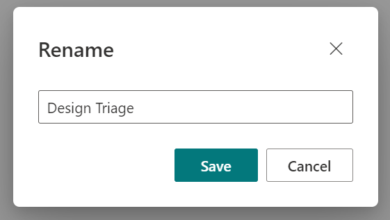

1. We want to store the Design name, description, and the submitter's name and email address (if they are requesting follow-up). We'll reuse the Title column for the Design name, but we'll need three other columns.

1. Click the **Add column** button and choose **TMultiple lines of text** then click **Next**:

    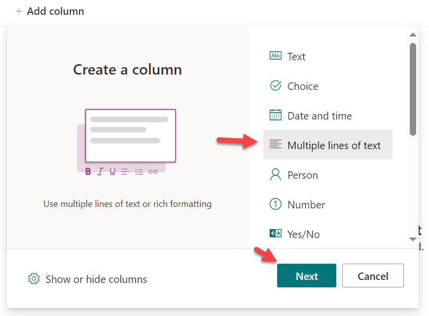

1. Name the column **Description** and expand the **More options** to toggle **Require that this column contains information** then click **Save**:

    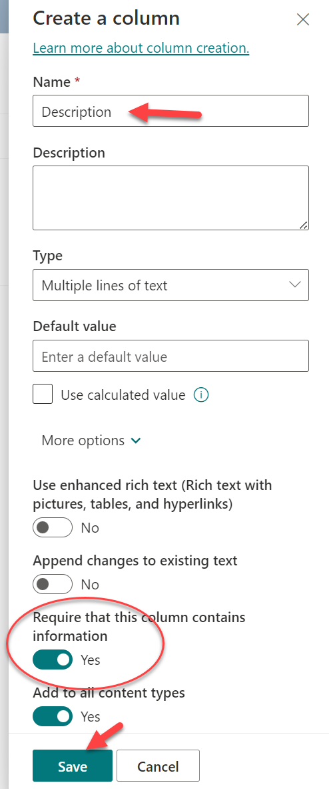

1. Click **Add Column** again and this time choose **Text** then click **Next**:

    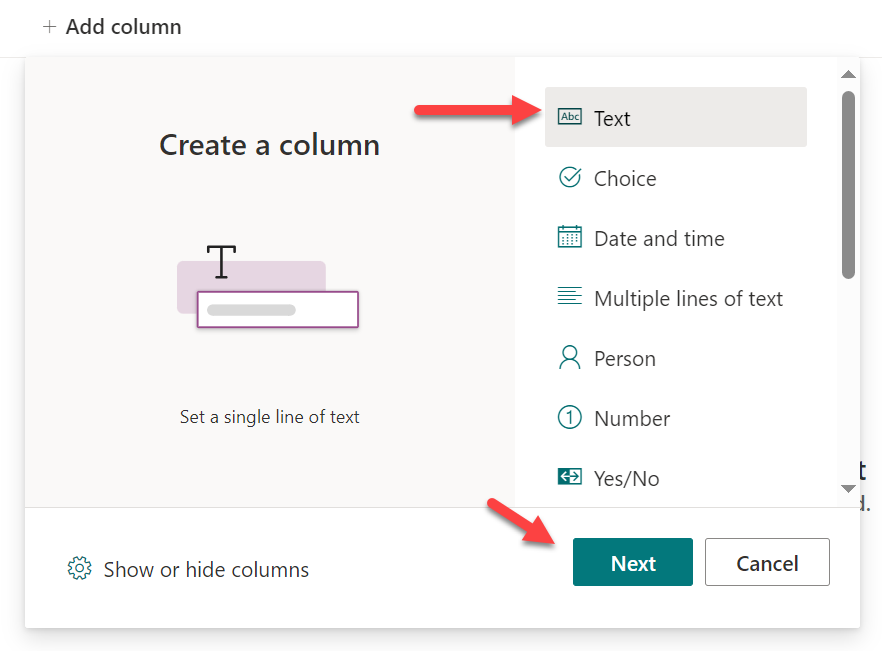

1. Name the column **Submitted By** and click **Save**

    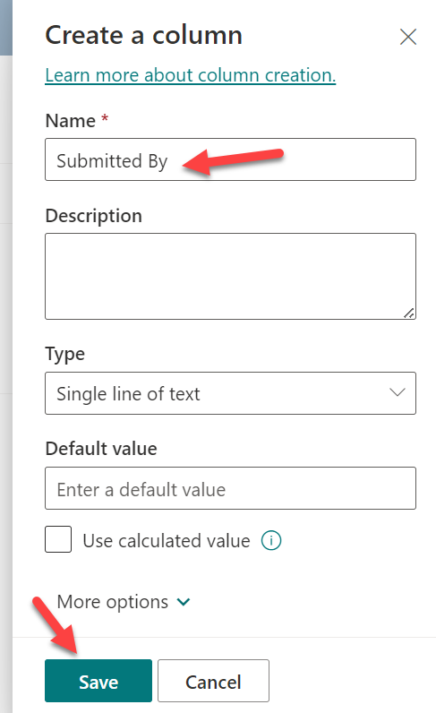

> :bulb: Unlike when we created the list, the internal column names will have the spaces stripped out when created from the modern list view. However, if you create them from the classic list settings page, you'll need to account for spaces and special characters.

1. Repeat the previous 2 steps to create a **Text** column named **Submitter Email**. You now have the four columns necessary to store the form results:

    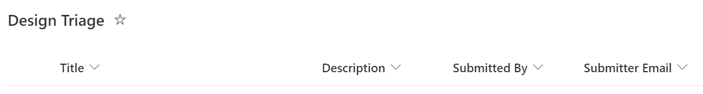

#### :books: Resources

- [Set up your SharePoint site with lists and libraries](https://learn.microsoft.com/sharepoint/dev/business-apps/get-started/set-up-sharepoint-site-lists-libraries)

## :rocket: Exercise 2: Add a choice column utilizing column formatting

We've got everything we need for the form responses, but it's very common for a triage list to have additional columns to assist in categorizing, cleaning, and routing the items. In our case, we're going to have the people triaging the requests assign a priority.

1. Click **Add a column** and choose **Choice** then click **Next**:

    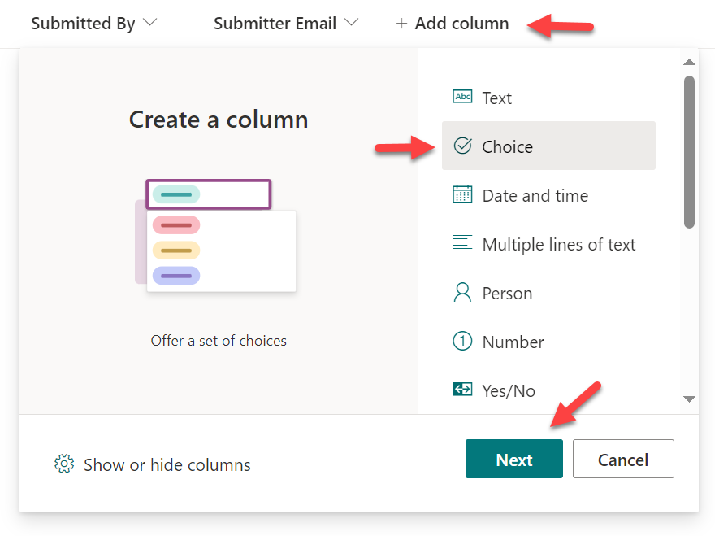

1. Name the column **Priority**. You can customize the choices by click on them to edit the text. Change them to **Low**, **Standard**, and **High**. Set the default value to **Standard** - don't save just yet:

    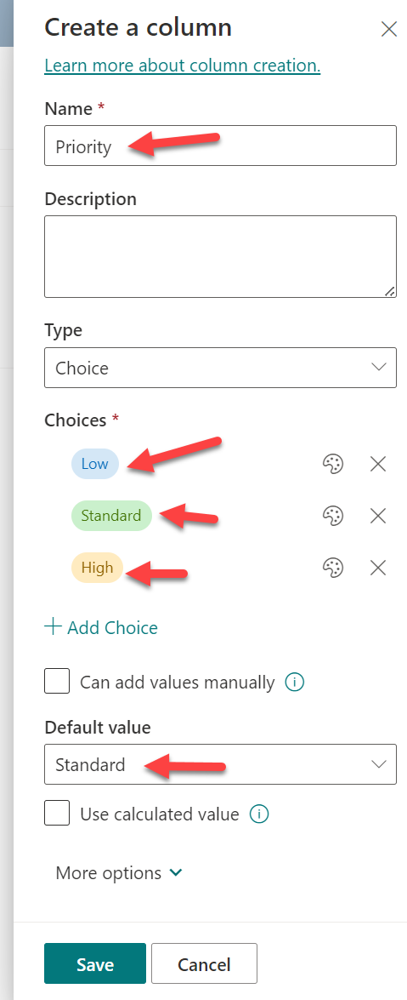

1. We can customize the color pills representing each choice by clicking on the palette icon next to each choice and choosing a style. Pick some styles you think represent the values then click **Save**:

    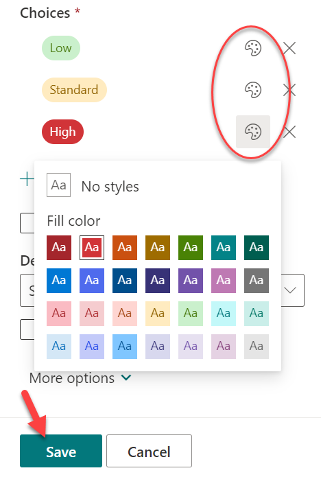

> :bulb: This type of customization is known as a Design Mode wizard. There are several pre-existing formats you can easily apply using configuration screens similar to this one to apply column/view formatting to your lists. These are often an excellent starting point to generate close to what you want and then to switch to the advanced editor to finalize.

#### :books: Resources

- [Format the pill shapes in a choice column](https://support.microsoft.com/office/format-the-pill-shapes-in-a-choice-column-6c886eab-7083-4d08-9ba3-ca92be4803f9)

## :rocket: Exercise 3: Create a flow to route form responses to the design triage list

When a form receives a response, a Power Automate flow can be triggered with the result of the response(s) allow you to take action and route that data as needed. In our case, we're going to dump it directly into our Design Triage list so it can be dealt with.

1. Head over to [Power Automate](https://make.powerautomate.com)

1. If you've got the new Copilot preview for creating flows, you can give it a try using this prompt: "Save Microsoft Forms responses to a SharePoint list" and you'll likely be pleased with the result:

    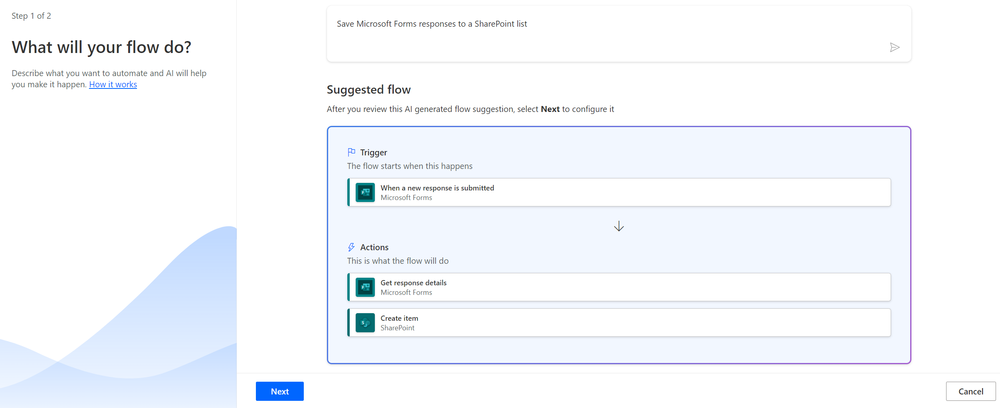

1.  For the rest of us, here are the instructions using the classic editing experience. Click **Templates** using the left navigation panel. Search for **"forms SharePoint"** and choose the **Record form responses in SharePoint** template:

    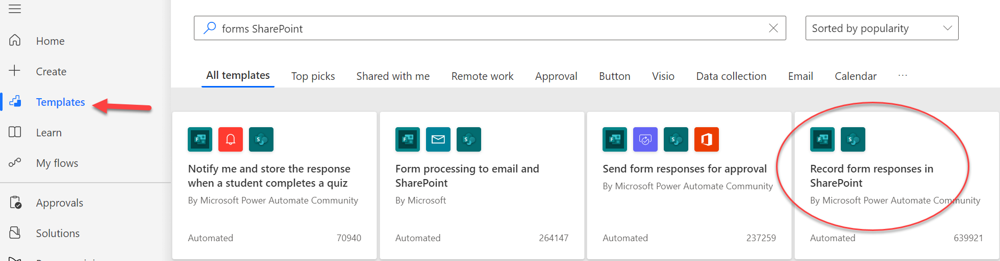

1. You'll be shown a list of the connections the flow will use (Microsoft Forms and SharePoint). You may be prompted to create the connections if this is the first time connecting to either or both of these services. Once the connections have a green checkmark next to them, click **Continue**.

1. Click on the default name in the top bar, "Record form responses in SharePoint", and give it a more meaningful name like "SWB - Design Requests from Forms to Design Triage".

1. In the first action, **When a new response is submitted**, click the **Form Id** dropdown and choose the form we created earlier. Do the same for the second action, **Get response details**:

    

1. In the third action, **Create item**, choose the SharePoint site where our Design Triage list is located in the **Site Address* column. If it isn't listed, choose custom value and paste the URL. Choose **Design Triage** in the **List Name** dropdown:

    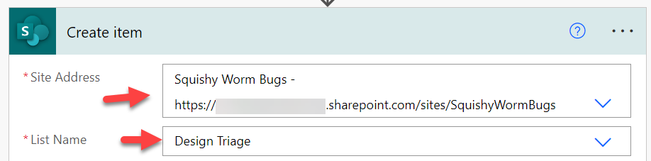

1. Click in each of the fields and use the **Dynamic content** picker to map the correct question to the field. The questions will be shown as you entered them. Choose **Standard** in the **Priority Value** dropdown:

    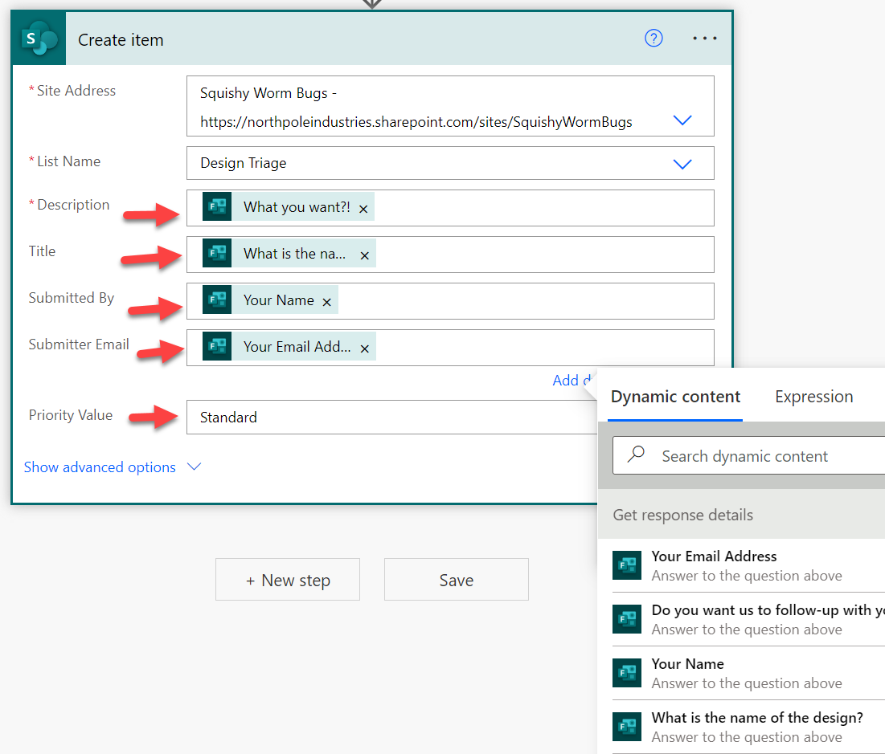

1. Save your flow

1. Go back to [Microsoft Forms](https://forms.microsoft.com) and submit a few responses and verify they end up in the Design Triage list (It should be relatively fast but could take up to 5 minutes). Some responses should request feedback and some shouldn't:

    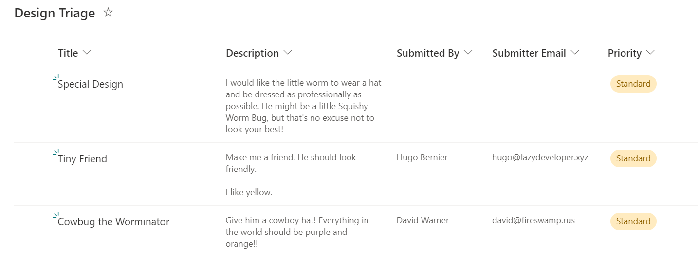

MAGICAL!!!

#### :books: Resources

- [Record form response in SharePoint Power Automate Template](https://powerautomate.microsoft.com/templates/details/2be590104bdd11e78896d10a96d3fac3/record-form-responses-in-sharepoint/)

## Next steps

If only there was a way to create a Power Automate flow to reject requests... Wait! There is!!! 

But you'll have to go to [Lab 4 to find out](../Lab04/README.md)