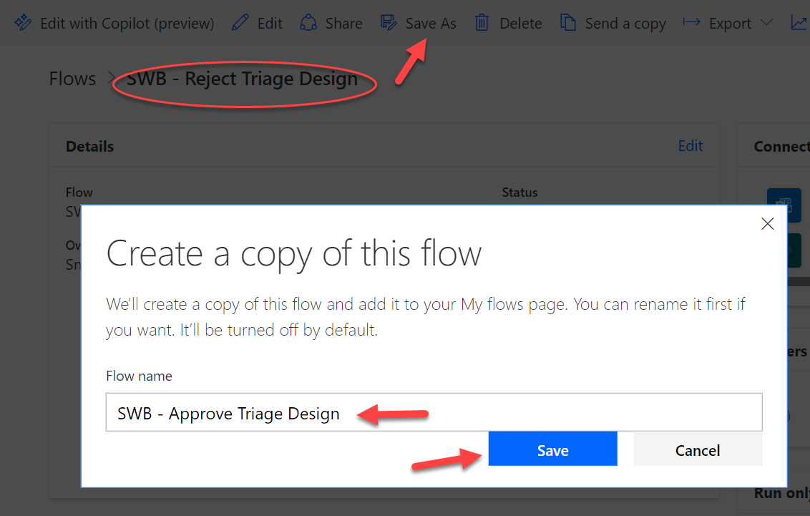
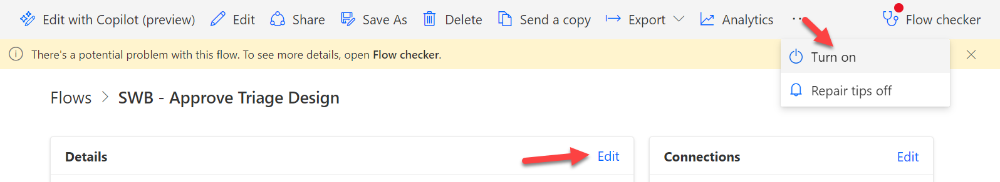
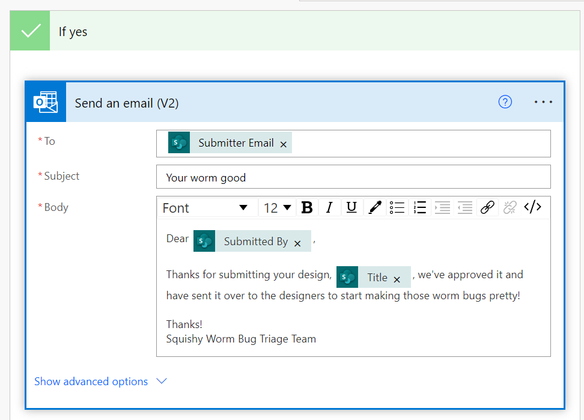
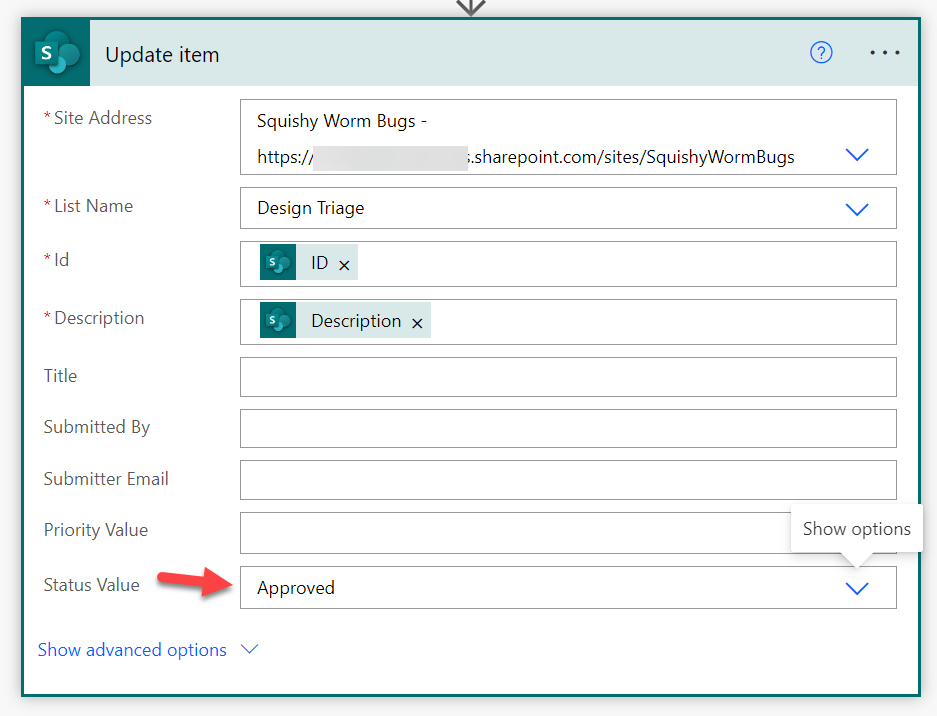
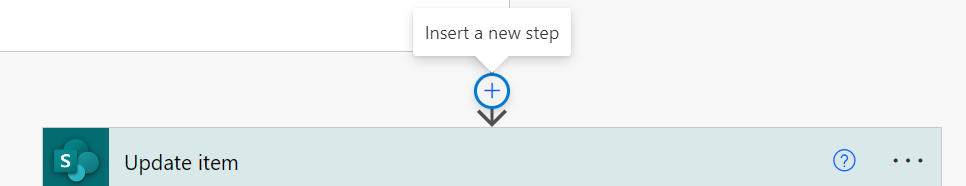
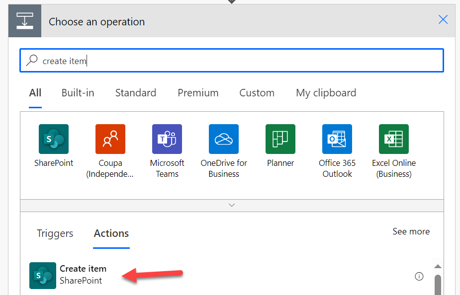
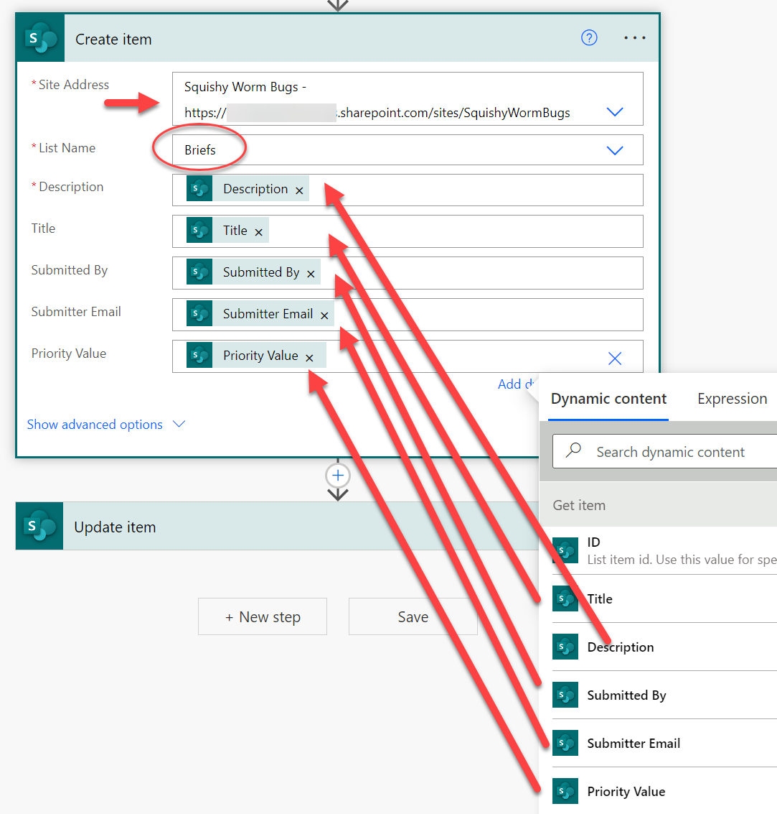

# Lab 05: Design Triage Approval Flow

Similar to the Reject Triage Design flow we previously built, we're going to create a Power Automate flow that will be manually triggered that will mark a Design Triage item as approved and perform any follow-up communications with the submitter as relevant. 

In addition, we're going to be promoting Design Requests from the Design Triage list to the Briefs list where Designers will use those briefs to design fabulous outfits for the Squishy Worm Bugs!

## :rocket: Exercise 1: Create a flow from an existing flow

Most of the Approve Triage Design flow will be very close to what we already built with the Reject Triage Design flow. So, let's start with that and save some time!

1. Head back to [Power Automate](https://make.powerautomate.com)

1. Open the flow details for the **SWB - Reject Triage Design** flow we created earlier.

1. Click **Save As**. In the **Create a copy of this flow** dialog, change the name to **SWB - Approve Triage Design** then click **Save**:

    

1. Click **My flows** in the left navigation panel and then choose the new **SWB - Approve Triage Design** flow we just created.

1. Copied flows are turned off by default, let's go ahead and turn this one on. Click **Turn on** (might be hidden in the overflow depending on your screen size). Then click **Edit** in the Details pane:

    

1. In the Details panel update the description to something like **"Approves Design Triage items, notifies the submitter, and creates a new Brief entry for the Designers."** then click **Save**

#### :books: Resources

- [Take a break, you've earned it](https://papertoilet.com/)

## :rocket: Exercise 2: Make the flow do the things we said the flow would do

1. Click **Edit** to begin editing the **SWB - Approve Triage Design** flow.

1. The first thing we need to change, is the wording of the email we send back to the submitter. Expand the **Condition** action and let's update the wording of the email:

    

1. Expand the **Update item** action and change **Status Value** from Rejected to **Approved**:

    

1. Click the **Insert a new step** plus icon on the connector above the **Update item** action to insert an action there:

    

1. Search for **create item** and select the **Create item** action from the SharePoint connector:

    

1. Select the site in the **Site Address** dropdown but this time choose the **Briefs** list in the **List Name** dropdown. Map each of the values from the **Get item** action. To map the **Priority Value** first choose **Enter custom value** in the dropdown, then you'll be able to use the **Dynamic content** chooser the same as the other fields.

    

1. **Save** your flow

#### :books: Resources

- [corndog.io](http://corndog.io/)