# Lab 2: Building an Intake Form

## :rocket: Exercise 1: Building a Microsoft Forms form

Welcome to the Power Platform Conference! Let's talk about... Microsoft Forms? We'll be doing a ton of stuff involving the Power Platform, but Microsoft Forms is a valuable tool to keep in your arsenal. It's full of limitations! But that's also why it's very easy to use and perfect for tons of use cases such as surveys, quick data collection, anonymous feedback, event planning, other stuff probably, etc.

1. Head over to [forms.microsoft.com](https://forms.microsoft.com) and sign in with your credentials.

> :bulb: For this and all other exercises in these labs, we strongly recommend getting a free [Microsoft 365 Developer Tenant](https://aka.ms/m365devprogram). It only takes a few minutes and you'll have an entire environment isolated from your organization's tenant.

1. Click **New Form** in the upper left corner:

    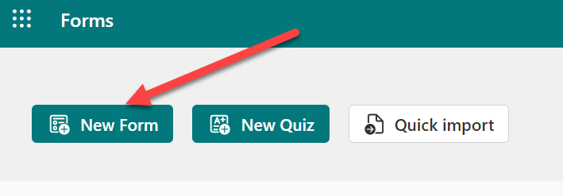

1. Click on the text **"Untitled form"** to provide your form a meaningful name. Something catchy like `Squishy Worm Bug Design Request`. Optionally, provide a description that help explains why someone would want to fill this thing out:

    

1. Time to add our first question! Press the **Text** button

    

1. Ask what they'd like to call their design. Mark it as required by flipping the toggle and then choose **Text** again to make the next question:

    

1. Next, we want them to describe the design. We'll provide a question like before, but click on the 3 dots in the bottom-right corner and enable **Subtitle** to allow us to provide relevant details/context to help them understand what we're looking for. toggle the **Long answer** toggle to give them more space to write. Then choose **Text** for our next question.

    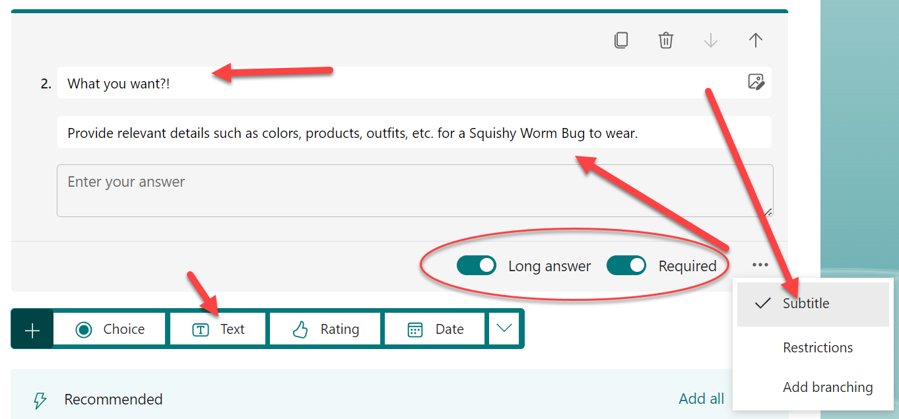

> :bulb: Notice that this question is automatically marked as Required. This is because Forms tries to help you out by assuming settings should keep applying as you go. It's super effective!

1. We're going to provide the option for the requestor to receive follow-up as their design moves through the process. Because we plan to make this form available anonymously to reach the widest audience, we have to ask for their contact details ourselves. Ask for their Name. Ensure Long answer is not toggled. You can leave the subtitle on and blank (it will be ignored) or you can remove it the same way we added it using the 3 dots menu. Click **Text** for our next question.

    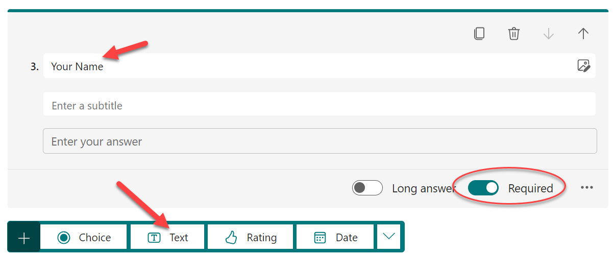

1. Names are nice, but simply shouting it and hoping they hear the follow-up is likely insufficient. So, let's ask for their email address:

    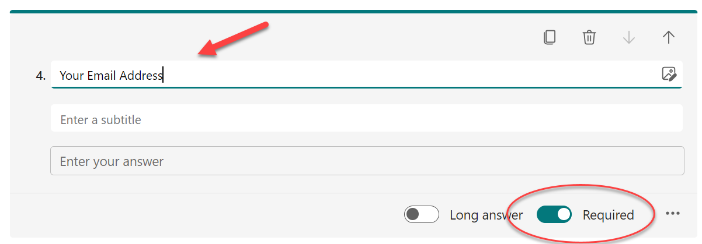

#### :books: Resources

- [Microsoft 365 Developer Tenant](https://aka.ms/m365devprogram)
- [Getting started with Microsoft Forms](https://www.youtube.com/watch?v=DtwFMLu3TJU) (Video)

## :rocket: Exercise 2: Getting fancy with branching

If you hit Preview on the Form you'll already have a pretty good looking form!

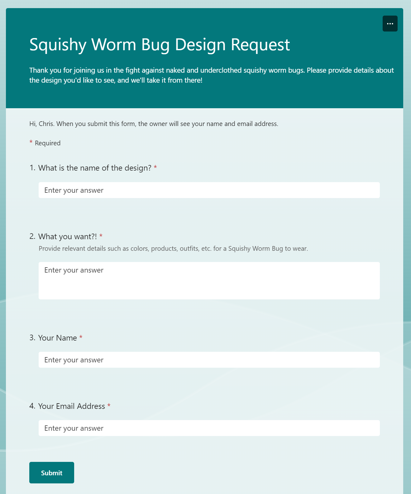

But... there's something weird you might have spotted. There's a little note at the top informing the user the owner will see the name and email address. Strange since we not only want to make this possible to be filled out anonymously, but we're also asking for it ourselves!

1. So, let's go make it anonymous! Using the 3 dots menu in the upper-right corner below your profile picture, choose **Settings**:

    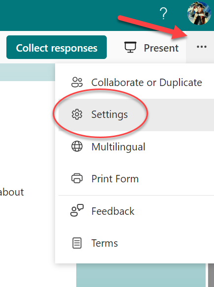

1. There's a lot of cool stuff in here so feel free to explore, but what we're looking for is right at the top under **Who can fill out this form**. Choose **Anyone can respond**.

    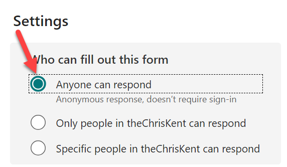

1. If you Preview the form again, you'll see the message has been removed. Of course, it's still weird to be asking for that information if we want this to be optionally anonymous with user's only having to provide their contact details if they want to recieve follow-up.

1. So, let's ask them if they want to recieve follow-up! Add a new **Choice** question asking if they want follow-up and let them answer Yes or No. You'll likely be given suggested choices (in fancy glowing green and purple), you can just click on those to avoid typing. It's like a mini-vacation!!

    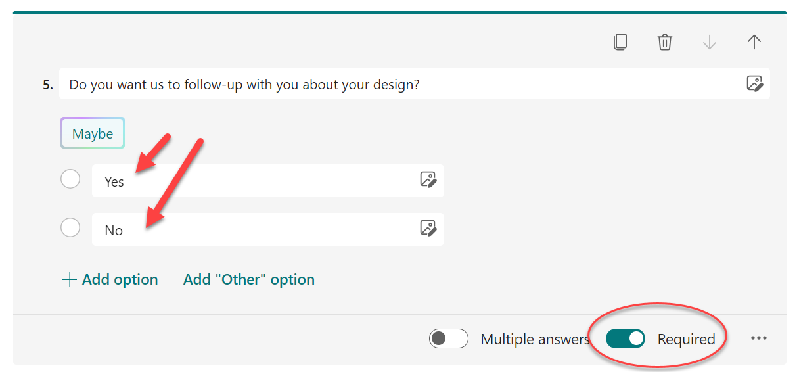

1. Great! But let's move that question up by clicking off the question (to stop editing it) and then simply dragging it above the question asking for their name and releasing. This will automatically renumber our questions. Try that Power Apps!

1. Now that we know if they want follow-up or not, we can apply Branching to allow our form to become a choose your own adventure style adventure for adventurers! Click on our choice question again (now question number 3) to edit it and choose the 3-dots menu in the bottom-right corner and choose **Add branching**:

    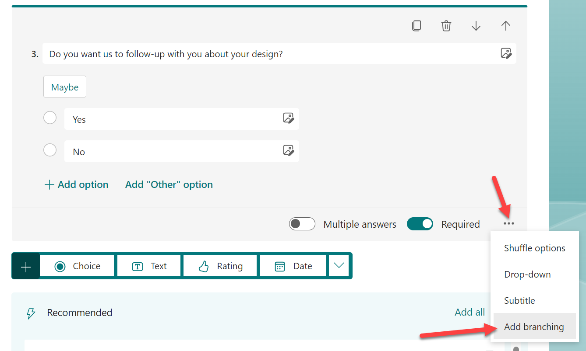

1. For those of us old enough to remember `GOTO` statements we'll either smile with nostalgia or scream with PTSD, but all you need to do is choose where the form should branch too based on what they choose. We've got 2 choices, so we get 2 destinations. Let's pick **Next** for **Yes** and **End of the form** for **No**:

    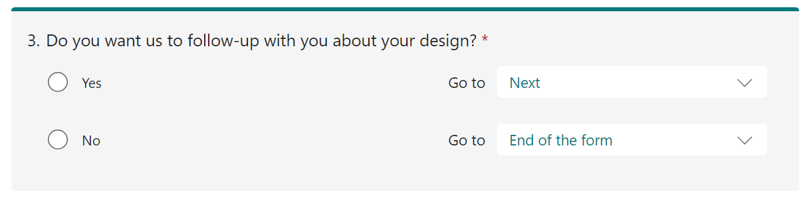

1. Preview the form and see that only the first 3 questions are shown until you respond to the 3rd question. Branching also handles our conditional required fields for us. The name and email address questions are only required if you choose **Yes**. Wowee!

#### :books: Resources

- [Use branching logic in Microsoft Forms](https://support.microsoft.com/office/use-branching-logic-in-microsoft-forms-16634fda-eddb-44da-856d-6a8213f0d8bb)

## :rocket: Exercise 3: De-uglify your form

If you're happy with the form, then you're good to go. Click **Collect responses** at the top to get the links, embed codes, QR codes, etc. and you're done!

For the rest of us, let's take 2 more minutes and make it not ugly and generic.

1. There are several style options available and more being added frequently including designs suggested by AI (lasers probably). You can click the **Style** button to open the panel and see the options. Choose something nice and preview it.

    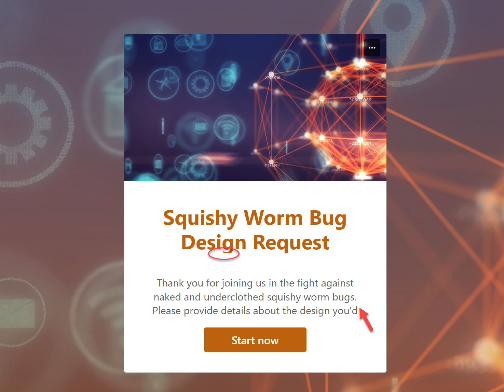

It's not perfect, so play around with it, but chances are you'll end up with a fancy looking form within just a few minutes. As we'll soon see, we can then leverage these programmatically and trigger all sorts of fancy things!

#### :books: Resources

- [Change a form theme](https://support.microsoft.com/office/change-a-form-theme-895ca902-833b-4f56-9488-f36480d837ef)
- [Design templates for forms](https://create.microsoft.com/forms-templates)

## Next steps

Proceed with [Lab 3](../Lab03/README.md)