# Lab 4: Design Triage Rejection Flow

We're going to create a Power Automate flow that will be manually triggered that will mark a Design Triage item as rejected and perform any follow-up communications with the submitter as relevant.

But first, we need to create a quick list for use later.

## :rocket: Exercise 1: Create a list from an existing list

Earlier we created a blank list and added each column individually. We only had a handful of columns, but you can imagine it can get tedious - especially if you've already created the same or similar list somewhere else!

Fortunately, SharePoint provides the option to create a list from an existing list. These are lists that exist on other sites in your tenant (that you have access to).

1. Go to the home page of your site and click the **New** menu and choose **List**. In the **Create a list** dialog, choose **From an existing list**:

    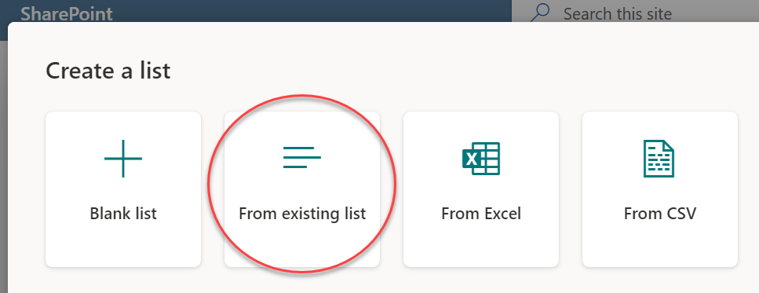

1. Choose the **(this site)** option and check the box next to **Design Triage** then click **Next**:

    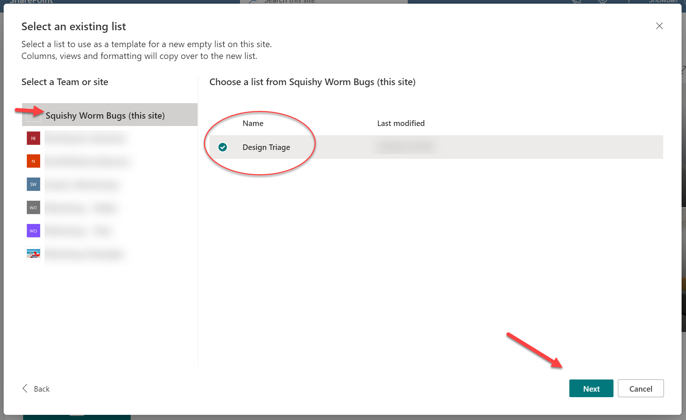

1. Set the name of the list to **Briefs** and click **Create**

1. We now have all the same columns we just configured in our Design Triage list (even the choice column format came over)! We will use this list in a later step.

#### :books: Resources

- [Create a new list based on the columns in another list](https://support.microsoft.com/office/create-a-new-list-based-on-the-columns-in-another-list-49666e8c-8c48-414f-8e5e-dc0e232acd27)
- [Create a list from the Lists app](https://support.microsoft.com/office/create-a-list-from-the-lists-app-b5e0b7f8-136f-425f-a108-699586f8e8bd)

## :rocket: Exercise X: Add a status column to the Design Triage list

Let's add a Status column to the Design Triage list. This will be used to filter views and ensure only unproccessed items are at the forefront. We didn't want this column in our Briefs list which is why we copied the list prior to adding it.

1. Go back to your Design Triage list

1. Click **Add Column** and choose **Choice** and click **Next**

1. Set the choices to **Pending**, **Approved**, and **Rejected**. Pick format colors as desired. Set the **Default value** to **Pending** then click **Save**:

    

> :bulb: There are lots of options for approving/rejecting items in SharePoint and Microsoft 365. We've just picked the simplest since it's just a triage list.

1. Update any existing items to add a Status of Pending. You can use the information panel to do bulk updates (select the affected items and press i to open the panel and then set the Status for all selected items at once).

#### :books: Resources

- [Require approval of documents in SharePoint using Power Automate](https://learn.microsoft.com/sharepoint/dev/business-apps/power-automate/guidance/require-doc-approval)

## :rocket: Exercise 2: Create a Design Triage rejection flow

1. Head back to [Power Automate](https://make.powerautomate.com)

1. Click **Create** using the left navigation panel

1. Click **Instant cloud flow**

1. Set the flow name to **"SWB - Reject Triage Design"**

1. Scroll down and choose **For a selected item** (SharePoint) then click **Create**:

    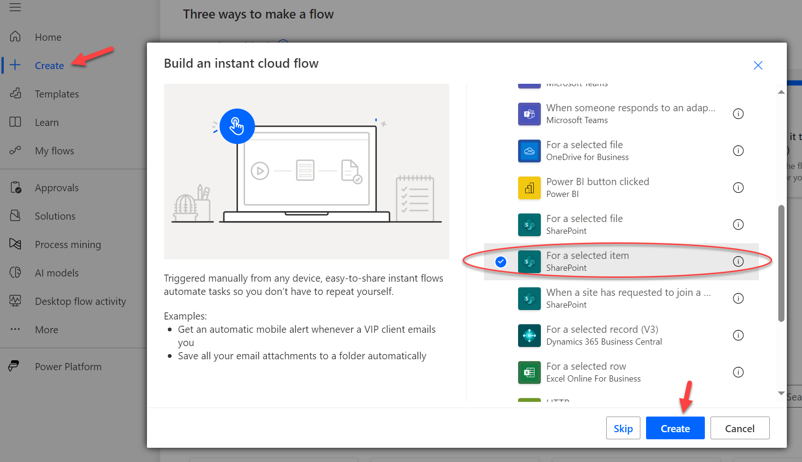

1. In the **For a selected item** choose the correct site for the **Site Address** field and then choose **Design Triage** in the **List Name** dropdown. Click **New step** to add an action:

    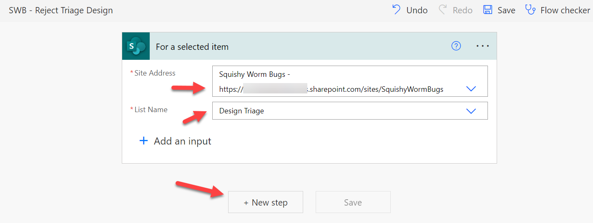

1. The trigger only tells us which list item was selected for the flow launch but doesn't provide the field values. So, let's get them! In the **Choose an operation** dialog search for **get item** and choose the **Get item** action of the SharePoint connector:

> :warning: Be sure to choose the singular **Get item** action not the **Get items** action!

1. Once again choose the correct site for the **Site Address** field and then choose **Design Triage** in the **List Name** dropdown. Use the **Dynamic content** chooser to pick the **ID** field from the **For a selected item** action. Then click **New step**:

    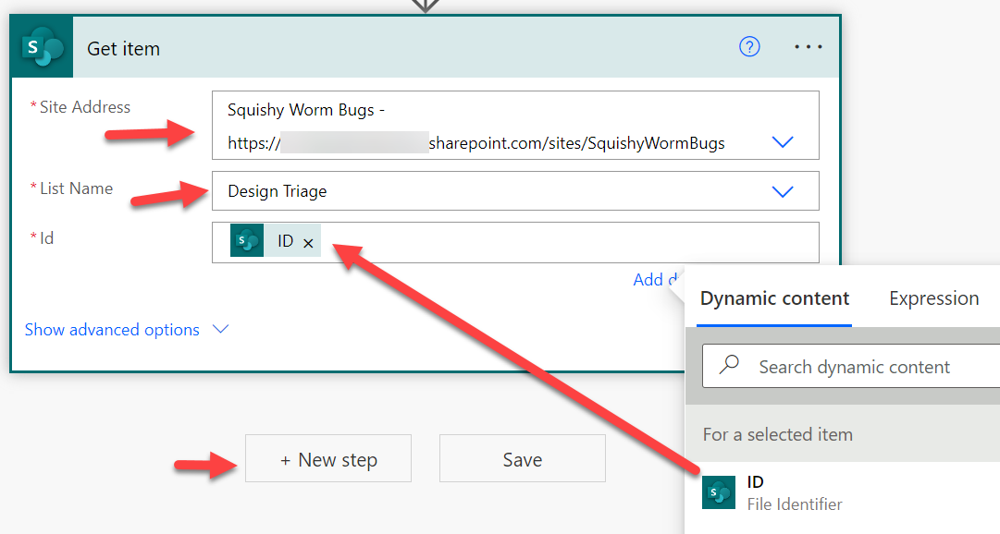

1. We only want to send a rejection notification if the submitter opted in for follow-up on their design. So, let's add a Condition. Generally, the **Condition** action is the default, but you can always search for it.

1. Click in the first box of the **Condition** action and use the **Dynamic content** chooser to pick the **Submitter Email** value from the **Get item** action:

    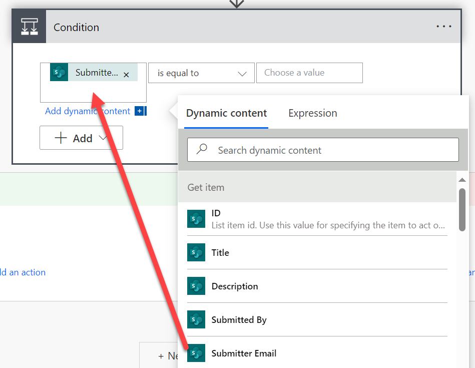

1. Change the expression to **"is not equal to"** and use the **Dynamic content** chooser and switch to the **Expression** tab and type **null**

> :warning: if your null value isn't pink with a fx symbol, it's just text. Make sure you set it only through the **Expression** tab

    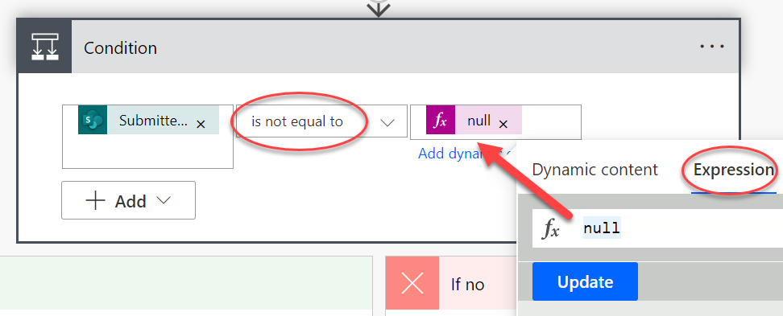

1. In the **If yes** side of the condition tree, click **Add an action**. In the **Choose an operation** dialog search for **send email** and choose the **Send an email (V2)** from the Office 365 Outlook connector.

    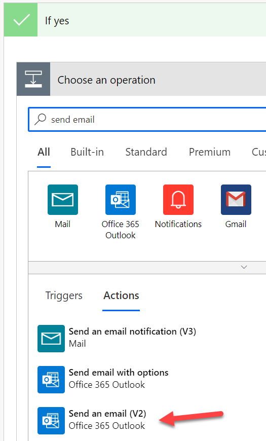

1. Use the **Dynamic content** chooser to map the **Submitter Email** to the **To** field. Provide a suitable subject and email message informing the submitter they're design idea is bad and they should feel bad:

    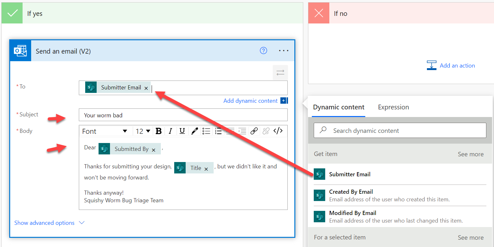

1. Just one more thing to do! Let's update the status column for the item. Click **New step** _outside_ the condition branches. Search for **update item** and choose the **Update item** action for the SharePoint connector:

    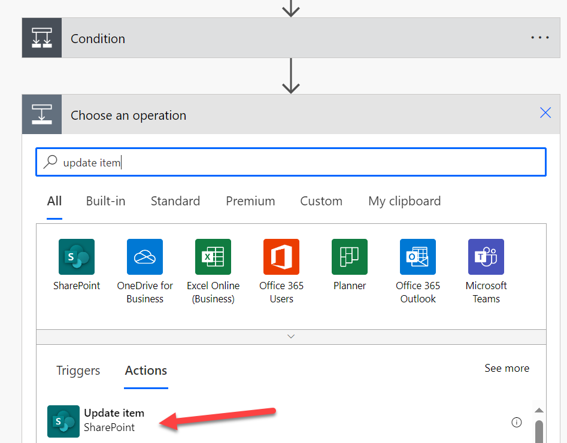

1. Once again choose the correct site for the **Site Address** field and then choose **Design Triage** in the **List Name** dropdown. Use the **Dynamic content** chooser to pick the **ID** field from the **For a selected item** action. You'll need to map the **Description** field because it's required and this connector is lame. Everything else can be left out and it'll just not overwrite those values. Be sure to clear out **Priority Value** by choosing **Enter custom value** and then leaving it blank. Set the **Status Value** to **Rejected**:

    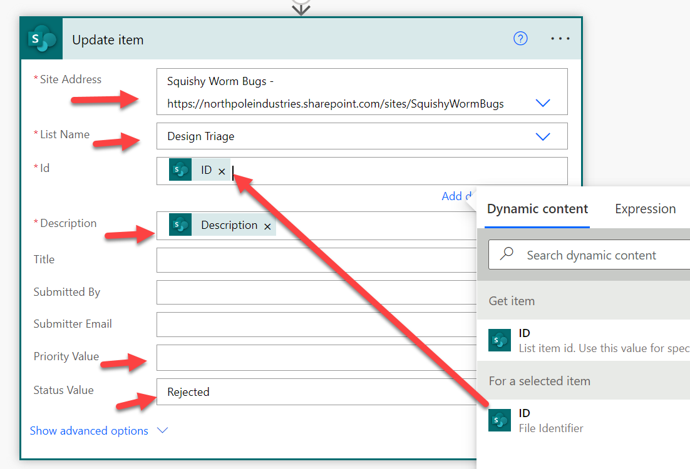

1. Save the Flow then click the back arrow next to the flow name to return to the flow details screen.

1. Click **Edit** in the details pane to bring up the Details panel. It's always a good idea to provide a description of what the flow does, but it's especially important for manually triggered flows. Put something like "Rejects Design Triage items and notifies the submitter".

#### :books: Resources

- [Complete a custom action for the selected item Power Automate template](https://powerautomate.microsoft.com/templates/details/64cb6f364936458b8f23652b6951fb28/complete-a-custom-action-for-the-selected-item/)

## Next steps

Bored? Move on to [Lab 5](../Lab05/README.md)