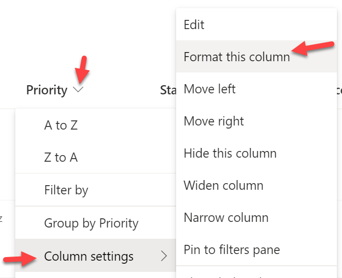
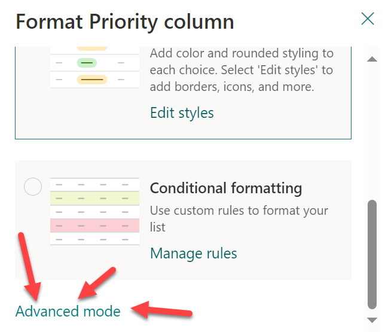
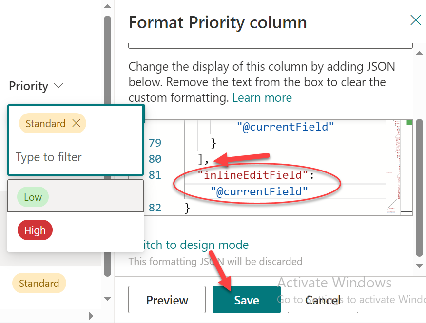
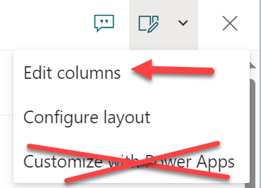
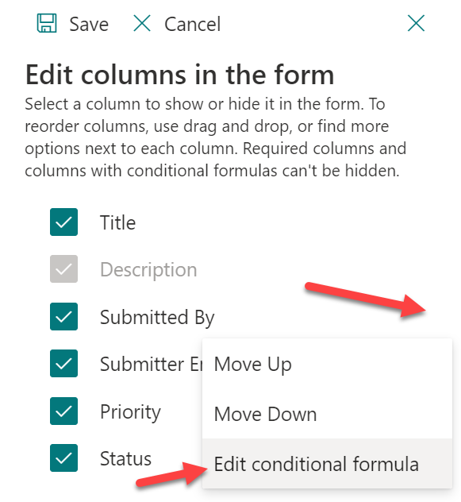
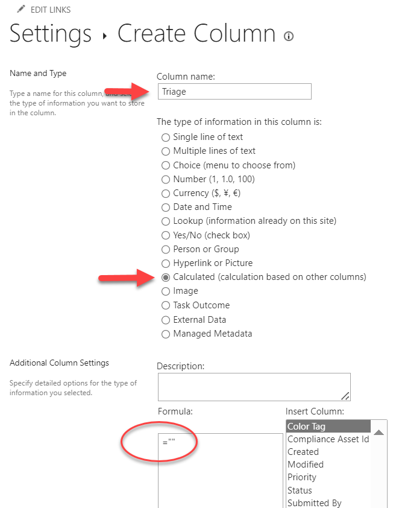

# Lab 06: Make it better with Formatting

## :rocket: Exercise 1: Make priority editing easier

Changing the priority of a Design Triage item will be a common task for the Worm Herders. Right now, they have to open the item, click on the Priority, set it, then close the form, and move on to the next. Let's make that easier.

There's already a format applied to the Priority column (choice columns get pills by default), and we like it just fine. So we're just going to tweak it with one of the most powerful and easiest format tweaks! WOWEE!

1. Click on the column header of the Priority column to open the column menu. Choose column settings > Format this column:

    

1. In the format edit panel, scroll down past the Design Mode wizards and click that **Advanced mode** link at the bottom to switch to the JSON editor:

    

1. In the editor, take a look at that format! It's using the Abstract Syntax Tree (AST) style expressions so it's extra long and harder to read. Yay? Regardless, we're just adding a single line to the very end.

    Scroll down to the bottom (line 80). Add a comma after the closing square bracket and then type `"inlineEditField": "@currentField"` then click **Save**. Now you can click on the Priority column and edit it immediately!

    

## :rocket: Exercise 2: Hide stuff on the list form

You can do some basic form customization using formatting. You can apply some layout grouping, header and footer formats, and provide expressions to conditionally show/hide non-required columns.

We only need to show the Submitter's information if it was filled out. Otherwise, it's just noise.

1. Open any list item (double click it) to open the list item form.

1. Click the form configuration icon and choose **Edit columns**:

    

1. Your list of columns are shown and you can simply uncheck any you don't want to show up (Required fields like Description can't be hidden). You can also apply conditional expressions to determine when to show/hide those columns. To do that, click the 3 dots next to the column then choose **Edit conditional formula**:

    

1. In the expression editor, paste the following:

```JSON
=[$SubmittedBy] != ''
```

    Conditional formulas for display need to return true (to show) or false (to hide). Just like in normal formatting, we start the expression with a `=` then we're saying only show it when it isn't blank. Exciting!

1. Let's do the same for the `Submitter Email` field using this expression:

    ```JSON
    =[$SubmitterEmail] != ''
    ```

1. You can uncheck the box from status as well. Now our form looks better and keeps extra junk out of the way!

1. Be sure to click **Save** so you don't lose your form customizations

## :rocket: Exercise 3: Create a flow launch button

Yes, you can select an item and then go to the command bar, wait for your flow to load in the sub menu, then choose the correct one based on your item's state, and receive a generic flow launch panel. But... that's not a great user experience. So let's apply some quick formats to make it much smoother.

1. We want a dedicated column for our flow launch buttons. This isn't required, but it's a common enough scenario we thought it best to show you!

1. Click **Add column** and scroll to the bottom and select **See all column types** then click **Next**:

    

1. Now we're on the classic field editor window! We did it! Set the name of the column to **Triage**, choose **Calculated column** as the column type and then use `=""` for the formula then click **OK**:

    

    This creates an empty calculated column. This prevents it from storing data and confusing users.

1. Now that we have an empty column, we can apply a format and use it as a format only field. One irritating thing, however, is that a relatively recent change added calculated columns to the list form as read only fields. Just open the form configuration and hide it like we did before.

1. Click on the column header for our new **Triage** column and choose **Column settings** > **Format this column** to launch the format editor panel.

1. Click on **Advanced mode** to open the JSON editor

1. Paste the following starter format (adapted from this sample:[generic-row-actions](https://github.com/pnp/List-Formatting/tree/master/column-samples/generic-rowactions))

```JSON
{
  "$schema": "https://developer.microsoft.com/json-schemas/sp/v2/column-formatting.schema.json",
  "elmType": "div",
  "children": [
    {
      "elmType": "button",
      "customRowAction": {
        "action": "executeFlow",
        "actionParams": "{\"id\":\"f7ecec0b-15c5-419f-8211-302a5d4e94f1\", \"headerText\":\"It's Flow Time!\",\"runFlowButtonText\":\"Do it\"}"
      },
      "attributes": {
        "class": "ms-fontColor-themePrimary ms-fontColor-themeDark--hover",
        "title": "Launch Flow"
      },
      "style": {
        "border": "none",
        "background-color": "transparent",
        "cursor": "pointer"
      },
      "children": [
        {
          "elmType": "span",
          "attributes": {
            "iconName": "Flow",
            "class": "ms-font-xxl"
          }
        }
      ]
    }
  ]
}
```

1. Hit preview to see an icon button was added. It doesn't do what we want yet, but there it is! So, let's make it do what we need.

